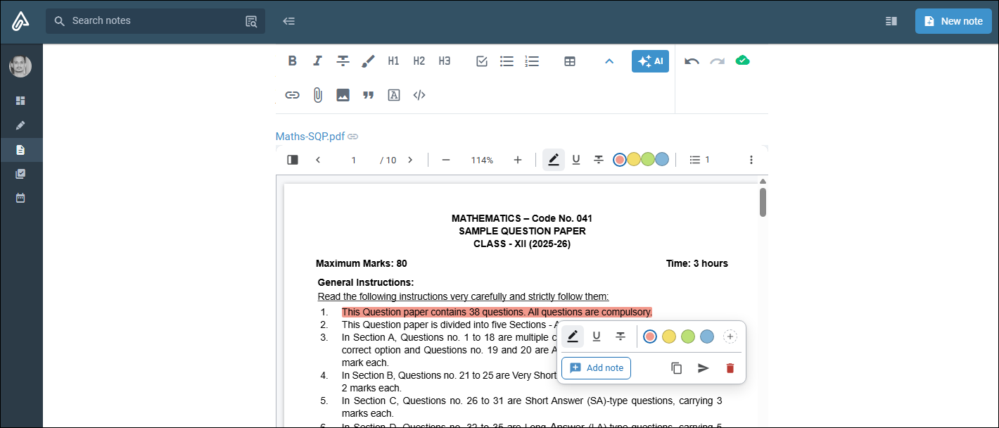
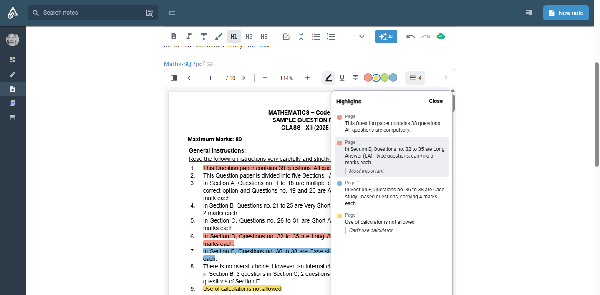
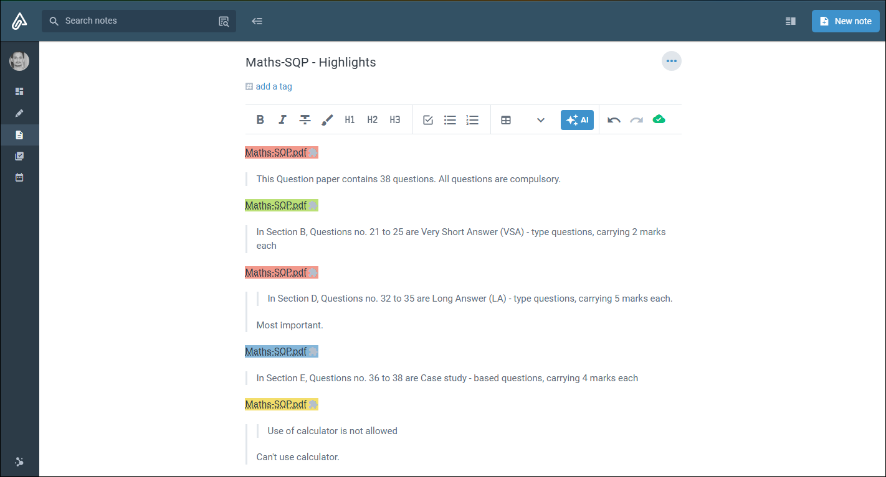
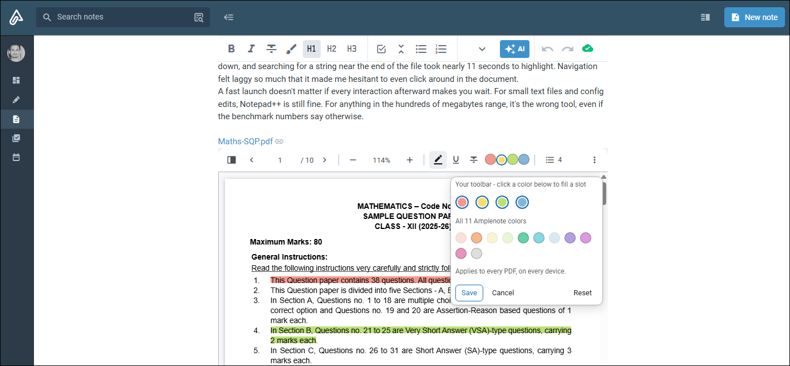
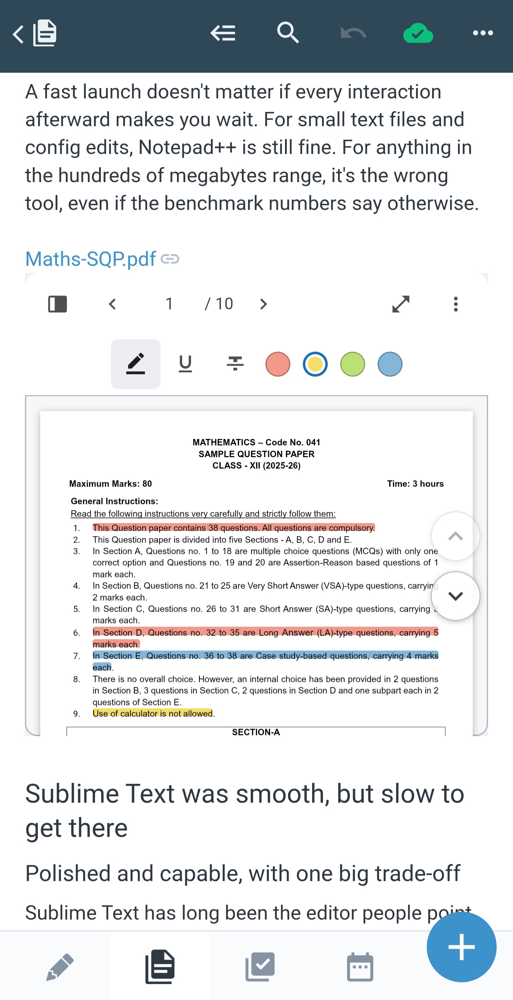
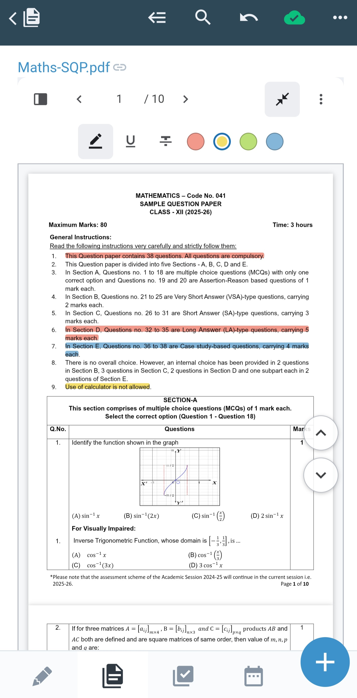

# Amplenote PDF Annotator

An [Amplenote](https://www.amplenote.com) plugin for highlighting and annotating PDFs
attached to a note. Select text in a PDF, highlight it in one of four colors, attach a
note to any highlight, save everything as **native PDF annotations** inside the file,
and export highlights back into Amplenote notes with deep-links that jump to the exact
page and position.

Install it from
**[its plugin page](https://public.amplenote.com/ZEJ7qV/pdf-annotator)**.



## What it does

- **Renders the PDF in the note** — a real text layer, zoom, page navigation and a
  thumbnails panel, with pages drawn as they scroll into view rather than all at once.
- **Highlight, underline or strike through, in four colors** — select text and pick a
  color from the toolbar or from the popover that appears at the selection. Click an
  existing mark to change its style, recolor it, or remove it.
- **Takes a note on any mark** — one plain-text note, offered as soon as the mark is
  created. A panel lists every mark and note, with click-to-jump.
- **Downloads with native annotations** — the Download button bakes everything into the
  PDF as real, selectable, reader-editable annotations, not painted-on rectangles — and
  each mark is written as its own proper subtype, so a highlight arrives as a Highlight,
  an underline as an Underline and a strikethrough as a StrikeOut in any external reader.
- **Copies a highlight into the note** — to the clipboard or straight into the note, as a
  deep link whose text carries the highlight's own color, in Amplenote's own
  `<mark style="background-color:#HEX;">…<!-- {"backgroundCycleColor":"N"} --></mark>`
  markdown.
- **Exports every highlight to its own note** — a "\<PDF name\> - Highlights" note,
  optionally filtered by color, each block carrying a `plugin://` deep link back to its
  exact page and position. Clicking one scrolls to the right PDF and flashes the
  highlight it meant, whether the link is on this note or another.
- **Works on a phone** — touch selection, fit-to-width, 40px targets, and on-screen
  scroll controls. Three behaviours vary by host rather than by device, and which host
  allows what is [measured below](#known-limitations-in-the-mobile-apps).

| The highlights panel | An exported highlights note |
|---|---|
|  |  |

## Installing into Amplenote

### Recommended: sync from GitHub

Install the [Plugin Builder](https://github.com/alloy-org/plugin-builder) plugin, then
in this plugin's note add a line pointing at this repo and an H1 heading named exactly
`Code block` above the code block:

```
repo: tashreefshareef/amplenote-pdf-annotator/dist/plugin.js
```

Run **Plugin Builder: Refresh** from the note's ⋯ menu and it pulls the latest build
straight from GitHub.

**One caveat.** Plugin Builder's own published `build/compiled.js` does not work when
pasted into its own plugin note against real Amplenote — three separate incompatibilities,
all of them silent. Paste
[`tools/plugin-builder-patched.js`](tools/plugin-builder-patched.js) into Plugin Builder's
note instead; it fixes all three and changes nothing about the sync logic. See
[what was wrong and why](docs/development.md#plugin-builder-compatibility).

### Fallback: paste by hand

Copy the entire contents of **`dist/plugin-paste.js`** (not `plugin.js` — that one omits
the final `return plugin` that Plugin Builder adds for you) into the note's code block.

Click **inside** the code block first, press Ctrl+A, and **confirm the selection covers
only the block** before pasting. Clicking slightly outside it makes Ctrl+A select the
whole note, and pasting then destroys the metadata table.

## Choosing your four highlight colors

The toolbar carries four color circles. Which four is up to you.

**In the viewer:** ⋮ → **Highlight colors…**. The popover shows your four slots above all
eleven Amplenote colors; click to fill a slot, click a slot to empty it, Save. The toolbar
repaints immediately and the choice follows you to every PDF and every device.



That requires one row in the plugin note's metadata table, which is what gives the plugin
somewhere to store it:

| setting | Highlight colors |
|---|---|

**Or by hand:** the same value is editable as text in Account Settings → Plugins → PDF
Annotator, since the picker writes exactly what you would have typed:

```
purple, pink, mint, sky
```

Names, labels or hex codes all work (`blue`, `Blue`, `#84B6D9`), in any order — the first
one becomes the color a fresh selection gets. Leave it empty and you get the four the spec
names: coral, yellow, green, blue.

The full eleven are `coral peach yellow green mint sky blue purple orchid pink grey` —
Amplenote's own mid-tone palette (indices 12–22; see `docs/api-notes.md`). **All eleven
stay available** on any existing highlight through the recolor popover, whatever your four
are. The setting decides what's one click away, never what's possible, so changing it can
never strand a highlight you already made.

Two things worth knowing:

- **It applies when a viewer next opens.** An embed already on screen keeps the colors it
  was rendered with — collapse and re-expand it to pick up a change.
- **Four is the cap.** Extra names are ignored rather than honoured; a fifth circle wraps
  the toolbar onto a second row on a phone.

## The "PDF Annotator data" section in your note

A plugin gets no database of its own, so every mark and note is written back into the
note the PDF is attached to, under a **PDF Annotator data** heading the plugin adds
itself. It holds a block of JSON keyed by attachment, so several PDFs on one note don't
collide, and it is labelled *"safe to ignore, don't edit"* in the note itself.

That label is literal. Editing or deleting the block resets or corrupts every mark and
note stored in it the next time one is saved. It always sits at the very bottom — "Send
to note" and every exported block are written just above it — so it stays out of the way
of your own writing rather than splitting it in half.

Worth knowing before you install rather than discovering after: the plugin does add
visible content to your note, and it isn't a bug.

**⋮ → Remove viewer** takes out the viewer's line *and* that PDF's entry in this section —
which means every mark and note you made on it. Other PDFs on the same note keep theirs.
It asks before doing it, because there is no undo afterwards.

The PDF file itself stays attached and still opens. What you can't do is put a viewer back
on it: **Annotate PDF** will report no PDF attachments on the note. Attaching the file
again gives you a viewer on the new copy. This is a platform limitation rather than a
choice — see [`docs/api-notes.md`](docs/api-notes.md) for the measurement.

## Formulas in a quoted PDF

Copy, Send to note and Export take their text from the PDF's text layer, and a PDF stores
no formulas — only glyphs at coordinates. A stacked fraction is a numerator and a
denominator drawn one above the other, separated by a **vector rule that is not text at
all**, so there is no `/` anywhere to extract.

Superscripts do survive, as `^`: `2x²` is quoted as `2x^2`. The character exists and a
raised baseline is unambiguous, so that much can be carried across. Fractions can't be —
`[−1/3, 1/3]` comes through as `[− 1 3 , 1 3]`, with the halves kept apart on purpose.
Joined flat, 1 over 3 becomes the number 13, and a quote that is wrong while looking right
is worse than one that is visibly incomplete.

What is guaranteed is that the prose around the notation survives — a quoted question
keeps one line per line of the original instead of breaking apart at every fraction.
Recovering the notation itself would need OCR against the rendered page, which a sandboxed
embed can't do.

## Known limitations in the mobile apps

Everything the plugin does works everywhere — selecting, highlighting, notes, the panel,
copy, send to note and export. Three behaviours vary, and they vary by **host**, not by
device:

| | Desktop Chrome | Android browsers | iOS browsers | iOS app | Android app |
|---|---|---|---|---|---|
| Drag to scroll the viewer | ✅ | ✅ | ✅ | ✅ | ❌ |
| Download the annotated PDF | ✅ | ✅ | ❌ | ✅ | ❌ |
| Deep link scrolls the note to the highlight | ✅ | ✅ | ❌ | ❌ | ❌ |

Android browsers tested: Chrome and Edge. iOS browsers tested: Safari, Chrome and Edge —
identical results, because **on iOS they are all the same engine**. Apple requires every
iOS browser to use WebKit, so "Chrome on iOS" is Safari's engine in a different shell. The
browser columns are decided by engine rather than by brand: Blink does all three, WebKit
does the gesture only.

**The apps are not just stricter versions of their browsers**, which is what makes this
worth a grid instead of a sentence. The iOS app downloads where every iOS browser refuses —
a native shell can act on a download its own web engine won't. The Android app goes the
other way, and is the only host that fails all three.

Two mechanisms, offered as likely reasons rather than verified causes: WebKit restricts a
`download` attribute originating in a cross-origin frame, which the iOS app handles itself;
and the note-scroll needs the host to move a document the embed cannot reach, which only
the two left-hand columns do.

Nothing here is reachable from inside the frame whichever way a host decides, so the viewer
ships its ▲/▼ scroll controls everywhere rather than detecting a device — the one host that
needs them is not the one a device check would predict.

One thing worth knowing before the limitations, because it is the first thing a phone
needs: a narrow screen gets an extra toolbar button beside ⋮. **Fit to this screen** sizes
the box to that particular phone, and becomes **Restore height** to put it back. It's a
one-time action stored with the note, not a live fit, so it stays exactly as you left it.

| Default height — **Fit to this screen** | After fitting — **Restore height** |
|---|---|
|  |  |

**Downloading fails in the Android app and in iOS Safari.** The Download menu item builds
the annotated file correctly on every platform, but a `download` attribute needs the host
to act on it and those two don't; the Web Share API, which is how a phone would
normally save a file, isn't delegated to the embed either. Rather than appear to succeed
and produce nothing, the viewer says the PDF is ready and where to save it if no file
appeared — conditionally, because a touch device is not proof of failure: Chrome on
Android and the iOS app both download normally, and telling those users their download
failed while the file sits in their downloads folder would be worse than saying nothing.
The grid above is why the check can't be a device test. Copy, Send to note and Export all
work everywhere — it's specifically the file that can't leave.

**On Android, dragging doesn't scroll the viewer.** The note claims the vertical drag
inside the embed; `overscroll-behavior`, a non-passive `touchmove` calling
`preventDefault()`, and focus were each tried against it on a real device and none of them
moved it. Use the ▲/▼ controls on the right edge of the viewer instead — hold one to keep
scrolling. They are there for every platform, so nothing depends on the gesture. The iOS
app and mobile browsers hand it to the embed and dragging works there.

It is specific to plugin embeds, not to the app's scrolling in general: **Amplenote's own
built-in PDF preview drag-scrolls perfectly well in the same Android app**, on the same
attachment. Open that attachment with this plugin instead and the gesture stops working.
So this is a gap in what the Android client hands to a third-party embed — reportable,
rather than a property of the device.

**In both apps and in iOS Safari, a deep link opens the right note and the viewer lands on
the right highlight — you scroll down to it yourself.** This is the most widely affected of
the three; only a desktop browser and an Android browser scroll the note for you.
Nothing inside the embed can move the mobile app's note, and
after a genuinely thorough attempt at a fix from outside the iframe — navigating with a
`…/notes/UUID#Section_name` fragment aimed at the heading above the embed, the platform's
own documented way to scroll a note to a section — it turned out not to be usable on
Android either: confirmed correct anchors, verified against Amplenote's own
`getNoteSections`, still failed to resolve, landing at the bottom of the note instead of
the top. Reapplying the exact code that once appeared to work and retesting it fresh
reproduced the same failure, which rules out a code regression — the mechanism itself
doesn't reliably work on the mobile client. See docs/api-notes.md finding 13 and
docs/bugs-found.md for the full account.

All three are recorded in [`docs/api-notes.md`](docs/api-notes.md) with what was tried, so
they aren't re-litigated as bugs. The attribution took three passes to get right, which is
worth knowing if you read that file: the first explanation was the sandbox, and it fitted
every observation because every observation had come from one host. Adding a mobile
browser killed it. Adding iOS narrowed what was left to a single shared limitation and two
Android ones. Each round only cost minutes of testing.

## Development

```bash
npm install
npm run build
```

[`docs/development.md`](docs/development.md) covers the rest: why there's a build step,
the standalone viewer harness, the repo layout, the testing approach and the constraints
the embed places on it, and the Plugin Builder compatibility fixes.

## Contributing

The full plan lives in
[`amplenote-pdf-annotator-spec.md`](amplenote-pdf-annotator-spec.md), the plugin note's
own instructions cell in [`docs/plugin-instructions.md`](docs/plugin-instructions.md), and
an account of what went wrong along the way in
[`docs/bugs-found.md`](docs/bugs-found.md).

1. Edit `src/`, not `dist/`.
2. Add a test for anything that touches note data, with a comment stating the scenario
   it validates.
3. Run `npm test` and `npm run build` before committing, and commit the rebuilt
   `dist/plugin.js` alongside your source change.
4. If you confirm and fix a real bug (not a design decision, an actual "this was
   wrong") in web-platform code — PDF.js, CSS, the DOM, browser selection APIs, the
   markdown-as-storage format — add an entry to
   [`docs/bugs-found.md`](docs/bugs-found.md): symptom, cause, fix, and the general
   lesson stripped of anything Amplenote-specific. Amplenote-platform-only findings
   (API signatures, sandbox quirks) go in `docs/api-notes.md` instead.

## License

MIT — see [LICENSE](LICENSE).
